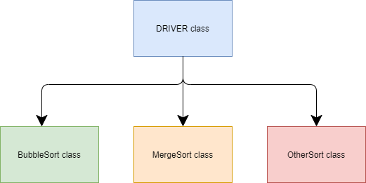

# Bahir Sorter Project

### Table of Contents
- ###### Block Diagram

### Project Purpose
**To create a new project that will incorporate the Bubble sort you’ve already done and a new Merge sorts algorithm.**

### Project Instructions
Take the code for your existing Bubble sort  and modify it, if necessary, to move the implementation of the sort into a separate class, calling it from a driver class which includes the user interface. Every sort algorithm should operate on arrays of ints and ideally the user interface should allow the user to select the number of (random) ints to be sorted.

Add timing to the sort using System.nanoTime().

Create a new implementation class for doing a Merge sort instead and incorporate this into your project, using a factory method and other design principles as appropriate.
Take care to use packages within your project as appropriate.
**
### Extensions
Consider using MVC in your project so that it can flexibly provide different interfaces as required.
At least implement SortManager and DisplayManager classes to separate out these basic responsibilities.

#### Block Diagram

#### Driver class
- [ ] User interface
- [ ] Create the array of int using user input
- [ ] Displays the output of the sorted array and time

#### ArrayGen class
- [ ] generates a random array
- [ ] takes the user input of size of array
- [ ] return the array

#### SORTING classes
- [ ] Sort an array of int in a method
- [ ] create necessary variables in private if needed
- [ ] record the time taken for the sort
